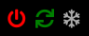

# MMM-TouchButton

This module displays buttons that can be controlled by touch or mouse click. As an action either a script can be run on the commandline or/and an notification can be send. Each button gets an unique css class based on a name to make it possible to change the size and color individually.
The module supports multi-instance since version 0.0.2. Feel free to add different configurations of the module at different positions to your mirror.
Since version 0.0.2 it is possible to change classes or icons based at the return code and output of the commands.

## Features

* Add icons as buttons to send notifications or call commands
* Either use [Fontawesome 4.7](https://fontawesome.com/v4/icons/), [Iconify](https://icon-sets.iconify.design) or images as icons
* Deceide which buttons to show depending on the current active profile ([MMM-ProfileSwitcher](https://github.com/tosti007/MMM-ProfileSwitcher))
* Add additional classes to the buttons to style them with CSS
* Add the module at multiple positions with different configurations

## Screenshots



## Installation

```bash
  
  cd ~/MagicMirror/modules
  git clone https://github.com/Tom-Hirschberger/MMM-TouchButton.git
  cd MMM-TouchButton
  npm install
```

## Configuration

**Warning: Do not use spaces in the buttons names. You can use spaces in the button titles but not in the names!**

```json5
  
        {
   module: "MMM-TouchButton",
   position: "bottom_left",
   config: {
    buttons: [
    ]
   },
  },
```

An example with three buttons. One to shutdown the host, one to reboot it and one to hide/show a module:

```json5
  
        {
   module: "MMM-TouchButton",
   position: "bottom_left",
   config: {
    buttons: [
     {
      name: "Shutdown",
      icon: "fa fa-power-off",
      command: "sudo",
      args: "shutdown -h now"
     },
     {
      name: "Reboot",
      icon: "fa fa-refresh",
      command: "sudo",
      args: "reboot"
     },
     {
      name: "Snow",
      icon: "fa fa-snowflake-o",
      notification: "MODULE_TOGGLE",
      payload: {hide: [], show: [], toggle:["Clock"]}
     },
    ]
   },
  },
```

**This module only sends notifications or calls scripts. If you want to get the module toggle example to work you need to install [MMM-ModuleToggle](https://github.com/Trekky12/MMM-ModuleToggle), too**

### General

| Option  | Description | Type | Default |
| ------- | --- | --- | --- |
| animationSpeed | If the module updates the visible objects the changes can be animated. | Integer | 0 |
| ~classes~ | Support has been removed with 0.0.11 of the module. Please use the module->classes option of MagicMirror instead. | ~String like "myClass1 myClass2~ | null |
| addEmptyTitle | If titles are used for some buttons this option makes it possible to add empty title dummys to all buttons without title | Boolean | false |
| buttons | The array containing an object for each button | Array [] | [] |
| refreshOnNotification | If conditions which use the payload of notifications as type the modules content gets refreshed if one of these notifications is received. | Boolean | true |
| refreshOnlyIfValueChanged | Normally the module gets refreshed if one of the conditional notifications gets received. If "refreshOnlyIfValueChanged" is set to true the module only gets refreshed if the payload of the notification changed to the last refresh. | Boolean | true |
| notificationsAtStart | If the module should send some notifications after the startup the can be configured in this array. The array should contain a array of for each notification. The first element is the name, the second one the payload. The payload is optional. (i.e. notificationsAtStart: [["dummyOne"], ["dummyTwo", "dummyPayload"]]). | Array | [] |
| notificationDelay | The notifications configured with notificationsAtStart will be send after this amout of milliseconds after the module got started. | Integer | 3000 |

### Buttons

| Option  | Description | Type | Default |
| ------- | --- | --- | --- |
| name | The name of the button. The button gets assigned a css class called "button-BUTTON_NAME". Do not use spaces in the name! | String | "" |
| icon | Choose an [Fontawesome 4.7](https://fontawesome.com/v4/icons/) or [Iconify](https://icon-sets.iconify.design) icon which should be displayed as a button. | String like "fa fa-refresh" or "fluent-emoji:test-tube" | "" |
| imgIcon | If you prefere to set a image as icon instead of a font icon you can configure the url with this option. Simply place the images in the "icons" directory. **If both the icon and imgIcon option are set the image icon is used!** | String like "./modules/MMM-TouchButton/icons/tom.jpg" | null |
| command | An command which should be run if the button gets pressed (only the command, the arguments will be configured seperatly) | String like "sudo" | "" |
| args | All arguments of the command that should be run. | String like "reboot" or a array of Strings | "" |
| title | An optional title can be added to buttons. Simply configure a String you want to display | String | null |
| notification | An notification that should be send if the button gets pressed. | String like "MODULE_LOGGLE" | "" |
| payload | The payload of the notification to send | Object like {toggle:["Clock"]} | {} |
| profiles | A space separated String which specifies at which profiles this button shuld be visible. If not present the button will be visible at all profiles. | String like "pageOne pageTwo" | null |
| classes | A space separated String with classes that should be added to the elements of this button. (May be overriden with the conditions) | String like "myButtonClass1 myButtonClass2" | null |
| conditions | You can add multiple conditions to this array which cause changes to the added classes and icons based on the output and return code of commands. See "Conditions" section for more details. | Array | null |

### Conditions

The module can be configured to display different icons or change the css classes added to the button elements based on the output or return codes of the commands or the payload of received notifications.

The conditions array contains objects that specify what to check against which values.

**The validation of the conditions stops at the first matching condition!**

The following compare types are possible:

* "lt" meaning lower than
* "le" meaning lower equal
* "gt" greater than
* "ge" greater equal
* "eq" equal
* "incl" includes
* "mt" value is a regex that should be matched

The following sources are possible:

* "out" which is the standard out stream (normal output) of the command
* "err" which is the error stream of the command
* "code" which is the return code of the command (unix style is to return 0 if everything is fine and anything else if a problem occured)
* "noti" the payload of the notification with the name/id specified with `notification` in the condition will be validated
* Any other string will be treated as the name of a notification (same as "noti" with `notification`)

And we need a value to compare to which is configured with the "value" option.

If the value is a valid JSON object you can use [jsonpath-plus](https://github.com/JSONPath-Plus/JSONPath) to search for a specific element (only the first one which matches the [jsonpath-plus](https://github.com/JSONPath-Plus/JSONPath) expression is used).

#### Example

Lets look at this example now:

```json5
{
  module: "MMM-TouchButton",
  position: "top_center",
  config: {
    classes: "tb1_1 tb1_2",
    buttons: [
      {
        name: "USER_PRESENCE",
        classes: "up_1",
        icon: "fa fa-circle-o",
        notification: "USER_PRESENCE",
        payload: true,
        conditions: [
          {
            source: "MY_DUMMY_NOTIFICATION",
            type: "eq",
            value: "dummy_payload",
            icon: "ic:baseline-lightbulb"
          },
          {
            source: "MY_DUMMY_NOTIFICATION_TWO",
            type: "eq",
            value: true,
            jsonpath: "output",
            icon: "fa fa-bath"
          }
        ]
      },
      {
        name: "Test",
        icon: "fluent-emoji:test-tube",
        command: "./test.bash",
        args: "0",
        profiles: "pageL1 pageL2 pageL3",
        conditions: [
          {
            source: "out",
            type: "incl",
            value: "my",
            icon: "fa fa-bath"
          },
          {
            source: "code",
            type: "lt",
            value: 1,
            imgIcon: "./modules/MMM-TouchButton/icons/tom.jpg"
          },
          {
            source: "err",
            type: "eq",
            value: "err1",
            classes: "err"
          }
        ]
      }
    ]
  },
},
{
  module: "MMM-TouchButton",
  position: "top_left",
  config: {
    classes: "tb2",
    buttons: [
      {
        name: "Reboot",
        icon: "fa fa-refresh",
        command: "sudo",
        args: "reboot"
      },
    ]
  },
},
```

In this example two instances of the module will be added at "top_center" and "top_left" position with the following features configured:

* All wrapper of the "top_center" module get the CSS classes "tb1_1" and "tb1_2" added
* Two buttons will be added to the module with position "top_center"
  * Button with name "USER_PRESENCE"
    * The elements get the html class "up_1" added
    * The icon will be "fa fa-circle-o"
    * If the button gets pressed the notification "USER_PRESENCE" with the payload "true" will be send
    * If a notification "MY_DUMMY_NOTIFICATION" with value "dummy_payload" is received by the module the icon "ic:baseline-lightbulb" is used instead of the normal icon "fa fa-circle-o". If the "MY_DUMMY_NOTIFICATION_TWO" notification is received with a JSON object as payload that contains the path "output" (i.e. {"output": false, "notNeeded": 123}) the icon "fa fa-bath" is used.
  * Button with name "Test"
    * The icon "fluent-emoji:test-tube" will be used (but not if the first conditions matches)
    * The command "./test.bash" will be called with the first argument set to "0"
    * The button will be only visible if the active profile is either "pageL1", "pageL2" or "pageL3"
    * If the output includes the String "my" the icon "fa fa-bath" will be used
    * If the return code of the command is lower than 1 the image icon with path "./modules/MMM-TouchButton/icons/tom.jpg" will be displayed
  * If the error output is equal to "err1" the class "err" will be added to the button
* One button will be added to the module with position "top_left"
  * Button with name "Reboot"
  * Will displayed with the icon "fa fa-refresh"
  * Will run the command "sudo" with argument "reboot"

**Remember: As the conditions will be validated in the order of their array position although the test.bash will return with a return code of 0 the icon "fa fa-bath" will be used and NOT the image icon because the condition of the output containing the String "my" will match first!**
